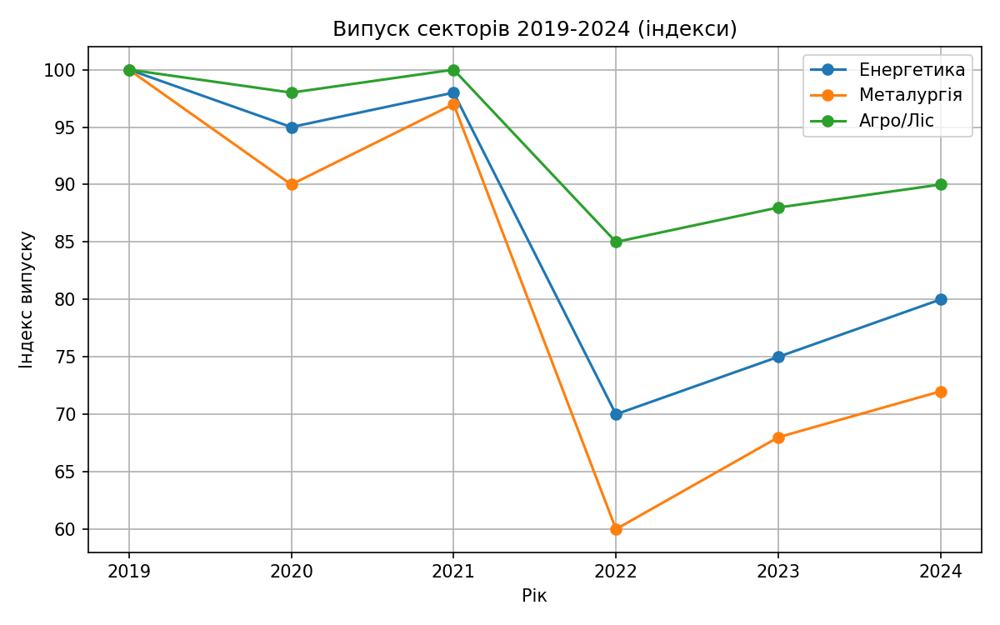
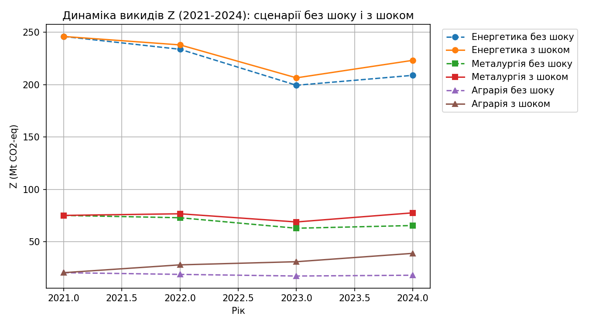
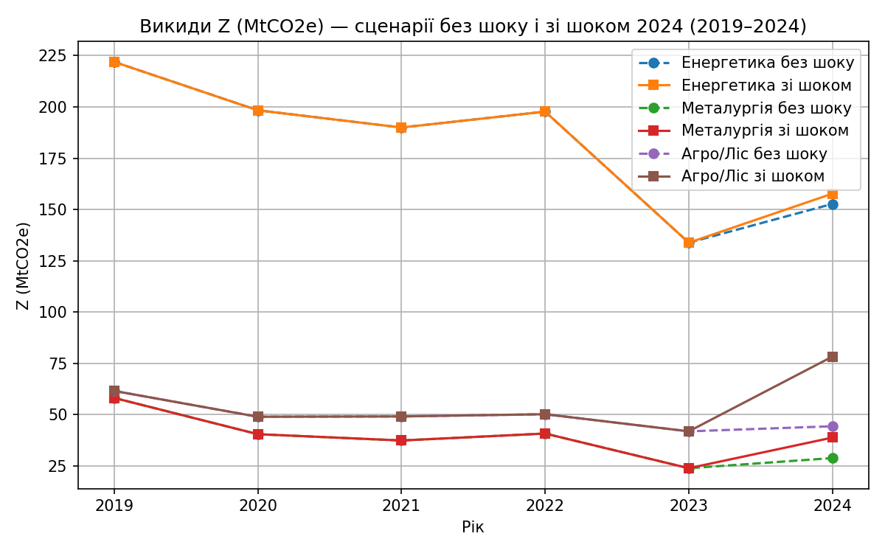
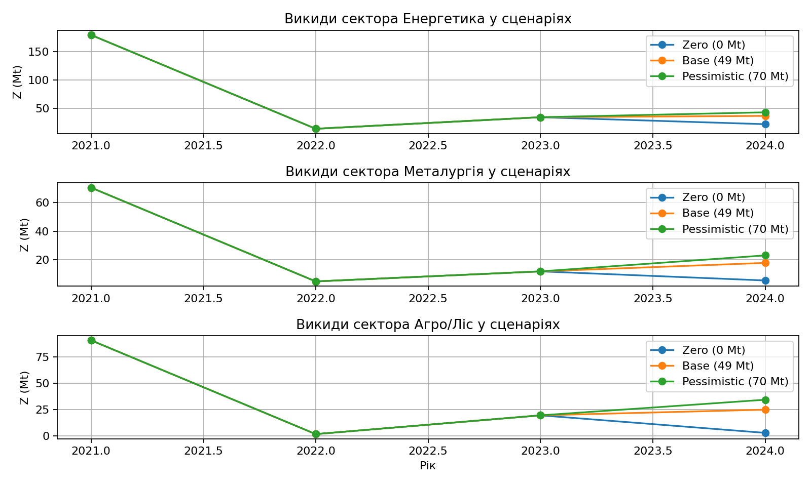
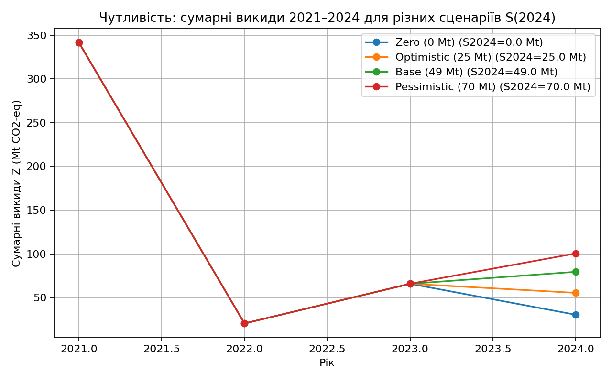

# Ukraine Economic & Environmental Analysis

## Project Overview

This project is based on my Master's thesis focused on numerical methods for a dual dynamic balance model of interindustry ecological-economic interaction.
The practical part of the research includes analysis of real Ukrainian economic and environmental data across multiple years.

## Objectives

- Analyze multi-year Ukrainian economic indicators
- Explore environmental impact trends
- Study relationships between industries
- Build forecasting scenarios using mathematical modeling
- Visualize results using Python

## Tools & Technologies

- Python
- Pandas
- NumPy
- Matplotlib
- Data Analysis
- Forecasting Models

## Key Features

- Real-world Ukrainian data analysis
- Trend analysis across years
- Economic-environment interaction modeling
- Visual dashboards and charts
- Scenario evaluation

## Key Visualizations and Results

This section presents the main results of the economic-environmental system simulation. The analysis focuses on production dynamics, emission behavior under different shock scenarios, and system sensitivity.

---

### Sector Output Dynamics (2019–2024)

This chart shows the evolution of sectoral production output in the Ukrainian economy over the analyzed period. It reflects structural changes in economic activity over time.



---

### Emissions under Shock Scenario (full-period shock)

This scenario demonstrates how environmental emissions evolve when a systemic shock is applied throughout the entire observation period.



---

### Emissions under Single-Year Shock (2024 only)

This scenario isolates the impact of a shock applied only in 2024, allowing comparison between localized and persistent shock effects.



---

### Sensitivity Analysis by Economic Sector

This analysis evaluates how different economic sectors respond to changes in model parameters, highlighting the most influential sectors in the system.



---

### Total System Sensitivity Across Scenarios

This chart summarizes the overall sensitivity of the economic-environmental system under different simulation scenarios.



## Key Insights

- Systemic shocks applied across the entire period lead to significantly stronger and more persistent changes in emissions compared to isolated shocks.

- A single-year shock (2024) shows more localized impact, with partial system recovery in subsequent periods.

- Sectoral output dynamics indicate structural changes in the Ukrainian economy over the 2019–2024 period.

- Sensitivity analysis reveals that certain economic sectors have a disproportionately high influence on system stability.

- The model demonstrates strong interdependence between economic activity and environmental indicators, confirming the validity of the dual balance approach.
- 
## Repository Structure

```text
data/           Raw and processed datasets
src/            Python scripts
charts/         Visualizations
docs/           Thesis PDF and project materials
